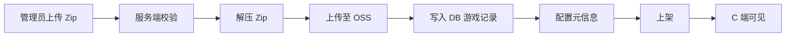
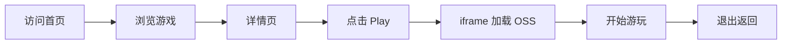

# MossGap 游戏平台 PRD

## 1. 产品概述

MossGap 是一个部署于 Cloudflare 的现代化 Web 游戏平台，支持管理员上传 Zip 游戏包并自动解压分发至 OSS，C 端用户通过浏览器即点即玩（iframe 加载）。

- **目标用户**：C 端面向全球休闲游戏玩家（英文优先，中英双语）；Admin 端面向平台运营人员（中文）
- **核心价值**：免安装、即点即玩的轻量游戏分发体验，配套高效的后台游戏管理能力
- **市场定位**：面向海外市场的 H5/静态游戏聚合平台，依托 Cloudflare 全球边缘网络实现低延迟访问

## 2. 核心功能

### 2.1 用户角色

| 角色 | 入口 | 核心权限 |
|------|------|----------|
| C 端用户 | `/[locale]` | 浏览游戏列表、查看详情、iframe 在线游玩、切换语言 |
| 管理员 | `/admin` | 上传 Zip 游戏包、配置游戏信息、管理游戏上下架、查看游戏列表 |

### 2.2 功能模块

**C 端（多语言：英文优先 + 中文）**
1. **首页**：Hero 推荐区、热门游戏、最新上架、分类导航
2. **游戏列表页**：分类筛选、搜索、分页/无限滚动
3. **游戏详情页**：游戏信息、截图预览、Play 按钮、相关推荐
4. **游戏游玩页**：iframe 全屏加载游戏、退出按钮、游戏信息浮层

**Admin 端（仅中文）**
1. **控制台**：数据概览（游戏总数、上架数、近期上传）
2. **游戏管理列表**：搜索、筛选状态、分页、编辑/上下架/删除操作
3. **游戏上传页**：上传 Zip 包、自动解压、填写游戏元信息
4. **游戏编辑页**：修改游戏信息、封面、分类、状态、OSS 路径

### 2.3 页面详情

| 页面名称 | 模块名称 | 功能描述 |
|----------|----------|----------|
| C 端首页 | Hero 推荐区 | 大图轮播展示精选游戏，CTA 进入游玩 |
| C 端首页 | 热门游戏 | 按游玩次数排序的卡片网格 |
| C 端首页 | 最新上架 | 按创建时间倒序的卡片网格 |
| C 端首页 | 分类导航 | 横向标签切换不同游戏分类 |
| C 端游戏列表 | 筛选栏 | 分类、排序方式、搜索框 |
| C 端游戏列表 | 游戏卡片网格 | 封面、标题、简介、Play 按钮 |
| C 端游戏详情 | 信息区 | 封面、标题、描述、分类标签、Play 按钮 |
| C 端游戏详情 | 截图预览 | 缩略图轮播展示游戏画面 |
| C 端游戏详情 | 相关推荐 | 同分类游戏横向滚动 |
| C 端游戏游玩 | iframe 容器 | 全屏 iframe 加载 OSS 游戏静态资源 |
| Admin 控制台 | 数据卡片 | 游戏总数、已上架、待上架、最近 7 天新增 |
| Admin 控制台 | 最近上传列表 | 最近 5 条上传记录及状态 |
| Admin 游戏列表 | 筛选搜索栏 | 按标题搜索、按状态筛选 |
| Admin 游戏列表 | 数据表格 | 标题、分类、状态、创建时间、操作列 |
| Admin 游戏上传 | 上传区 | 拖拽上传 Zip，显示上传进度 |
| Admin 游戏上传 | 元信息表单 | 标题、描述、分类、封面、入口文件 |
| Admin 游戏编辑 | 编辑表单 | 修改所有游戏配置项 |
| Admin 游戏编辑 | 状态控制 | 上架/下架切换、删除按钮 |

## 3. 核心流程

### 3.1 管理员上传游戏流程

管理员在 Admin 端上传 Zip 游戏包 → 服务端接收并校验 Zip → 调用 OSS SDK 将 Zip 解压后逐文件上传至 OSS 指定目录 → 在数据库写入游戏记录（含 OSS 访问路径、入口文件） → 管理员配置游戏元信息（标题、描述、分类、封面） → 上架 → C 端可见可玩。

### 3.2 C 端用户游玩流程

用户进入首页 → 浏览/搜索游戏 → 进入游戏详情页 → 点击 Play → 跳转至游玩页 → iframe 加载 OSS 上的游戏入口 HTML → 用户开始游戏 → 点击退出返回详情页。

## 4. 用户界面设计

### 4.1 设计风格

**C 端（游戏平台，暗黑霓虹风）**
- 主色：深邃黑紫底色 `#0A0A0F` + 霓虹青 `#00F0FF` 强调 + 电光紫 `#9D4EDD` 次强调
- 按钮风格：圆角胶囊按钮，霓虹发光边框，hover 时辉光扩散
- 字体：标题用 `Orbitron`（科技未来感），正文用 `Rajdhani`（清晰几何感）
- 布局：顶部固定导航 + 全宽 Hero + 卡片网格主体
- 图标：线性霓虹风格，配合发光效果
- 动效：卡片 hover 上浮 + 霓虹描边、Hero 视差/粒子背景、页面切换淡入

**Admin 端（后台管理，专业简洁）**
- 主色：浅灰背景 `#F8FAFC` + 主色蓝 `#2563EB` + 中性灰文字
- 按钮风格：shadcn 默认圆角按钮，主操作蓝色，危险操作红色
- 字体：系统默认 `system-ui`，保证可读性
- 布局：左侧固定侧边栏 + 顶部面包屑 + 右侧内容区
- 图标：Lucide 线性图标
- 动效：表格行 hover 高亮、模态框淡入、Toast 反馈

### 4.2 页面设计概览

| 页面名称 | 模块名称 | UI 元素 |
|----------|----------|---------|
| C 端首页 | Hero 推荐区 | 全宽暗黑背景 + 霓虹标题 + 粒子动效 + CTA 胶囊按钮 |
| C 端首页 | 游戏卡片 | 圆角卡片 + 封面图 + 标题 + hover 霓虹描边发光 |
| C 端首页 | 分类导航 | 横向胶囊标签 + 选中态霓虹填充 |
| C 端游戏游玩 | iframe 容器 | 全屏黑底 + 顶部退出浮层 + 加载骨架 |
| Admin 控制台 | 数据卡片 | 4 列白卡 + 数字 + 图标 + 趋势色 |
| Admin 游戏列表 | 数据表格 | shadcn Table + 状态徽章 + 操作按钮组 |
| Admin 游戏上传 | 上传区 | 虚线边框拖拽区 + 进度条 + 文件列表 |

### 4.3 响应式

- **C 端**：桌面优先（卡片网格 4 列），平板 2 列，移动端 1 列；导航移动端折叠为汉堡菜单
- **Admin 端**：桌面优先（侧边栏 + 内容），平板侧边栏可折叠，移动端侧边栏抽屉式
- **触摸优化**：C 端卡片点击区域 ≥ 44px，Admin 按钮间距适配触摸

### 4.4 3D 场景

不适用（本项目以 2D 静态游戏为主，无 3D 场景需求）。
